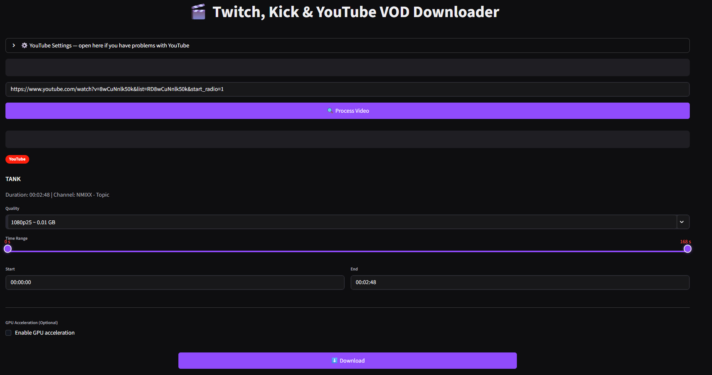

# 🎬 Twitch, Kick and YouTube VOD Downloader

A modern Streamlit web application for downloading Twitch VODs, Kick videos and YouTube videos with advanced features including GPU acceleration, quality selection, and time range trimming.


<p align="center">
  
</p>


## ✨ Features

- **🎯 Multi-Platform Support**: Download from Twitch, Kick and YouTube platforms
- **🎬 Quality Selection**: Choose from available video qualities and framerates
- **⏱️ Time Range Trimming**: Download specific segments using time selection or slider
- **🚀 GPU Acceleration**: Optional hardware encoding with NVIDIA NVENC, AMD AMF, Intel VAAPI/QuickSync
- **🎨 Modern UI**: Dark theme interface inspired by Twitch design
- **⬇️ Progress Tracking**: Real-time download progress with cancellation support
- **📱 Responsive Design**: Works on desktop and mobile devices


### Prerequisites

- Python 3.11 or higher
- [uv](https://docs.astral.sh/uv/) - Ultra-fast Python package manager
- [FFmpeg](https://ffmpeg.org/download.html) - For audio/video processing

### Installation steps

1. **Clone or navigate to the project**:

2. **Install dependencies with uv**:

```bash
# Create virtual environment and install dependencies
uv sync
```

> **Note**: The project uses `uv` for fast dependency management. If you prefer pip, you can generate requirements.txt first:
>
> ```bash
> uv pip compile pyproject.toml -o requirements.txt
> pip install -r requirements.txt
> ```

3. **Install FFmpeg** (required for video processing):
   - **Windows**:
     ```bash
     winget install Gyan.FFmpeg
     ```
     or download from [gyan.dev](https://www.gyan.dev/ffmpeg/builds/)
   - **macOS**: `brew install ffmpeg`
   - **Linux**: `sudo apt install ffmpeg`

4. **Verify installation**:

```bash
uv run python -c "import streamlit; print('Streamlit version:', streamlit.__version__)"
ffmpeg -version  # Should show FFmpeg version
```

### Installation steps

1. **Clone or navigate to the project**:


2. **Install dependencies with uv**:

```bash
# Create virtual environment and install dependencies
uv sync
```

Create the project with uv without initializing git use --bare

```python
uv init --python 3.11 --bare
```

But create the file .python-version

Option A: Using requirements.txt

```python
# Generate requirements.txt from pyproject.toml
uv pip compile pyproject.toml -o requirements.txt

#if use pip :
pip install -r requirements.txt 

# Install dependencies from requirements.txt

uv add -r requirements.txt
```

Option B: Direct sync

```python
uv sync
```

3. **Install FFmpeg** (if you don't have it):
   - **Windows**: `winget install Gyan.FFmpeg` or download from [gyan.dev](https://www.gyan.dev/ffmpeg/builds/)
    ```bash
    # Con winget (recomendado en Windows)
    winget install Gyan.FFmpeg
    ```
   - **macOS**: `brew install ffmpeg`
   - **Linux**: `sudo apt install ffmpeg`

4. **Verify PyTorch installation**:

```bash
uv run python -c "import torch; print(torch.__version__); print(torch.cuda.is_available())"
```

## 🎯 Usage

### Start the application

```bash
# Activate virtual environment
.venv\Scripts\activate  # Windows
source .venv/bin/activate  # macOS/Linux
```

or / and

```bash
# Run application for not open browser inmediatly
uv run streamlit run app.py --server.headless true
```
or for something windows 11 dont work 

```bash
# Run application for not open browser inmediatly
uv run python -m streamlit run app.py --server.headless true
```

```bash
# Run application
uv run streamlit run app.py
```

The application will automatically open in your browser at `http://localhost:8501`

### How to Use

1. **Enter Video URL**: Paste a Twitch VOD or Kick video URL
   - Twitch: `https://www.twitch.tv/videos/...`
   - Kick: `https://kick.com/video/...`

2. **Process Video**: Click "🔍 Process Video" to extract video information

3. **Configure Download**:
   - **Quality**: Select from available video qualities (1080p60, 720p60, etc.)
   - **Time Range**: Use the slider or input fields to select specific segments
   - **GPU Acceleration**: Enable hardware encoding for faster processing (optional)

4. **Download**: Click "⬇️ Download" to start the download process
   - Monitor progress in real-time
   - Cancel downloads if needed
   - Save the video when complete

### GPU Acceleration

The application automatically detects available GPU encoders:

- **NVIDIA**: NVENC (h264_nvenc)
- **AMD**: AMF (h264_amf)
- **Intel**: VAAPI (h264_vaapi) or QuickSync (h264_qsv)

Enable GPU acceleration for significantly faster encoding when downloading large video segments.

## 🛠️ Technical Details

### Dependencies

- **Streamlit**: Web framework for the user interface
- **yt-dlp**: Video extraction and downloading
- **FFmpeg**: Video processing and encoding
- **Python 3.11+**: Runtime environment

### Architecture

- **Frontend**: Streamlit web interface with custom CSS styling
- **Backend**: Python-based video processing pipeline
- **GPU Support**: Hardware acceleration via FFmpeg encoders
- **File Handling**: Temporary file management with automatic cleanup

### Supported Formats

- **Input**: Twitch VODs, Kick videos
- **Output**: MP4 (H.264/AAC)
- **Qualities**: Variable based on source (up to 1080p60+)

### 📄 License

This project is licensed under the MIT License - see the [LICENSE](LICENSE) file for details.

---

## 👨‍💻 Author / Autor

**Diego Ivan Perea Montealegre**

- GitHub: [@diegoperea20](https://github.com/diegoperea20)

---

Created by [Diego Ivan Perea Montealegre](https://github.com/diegoperea20)
