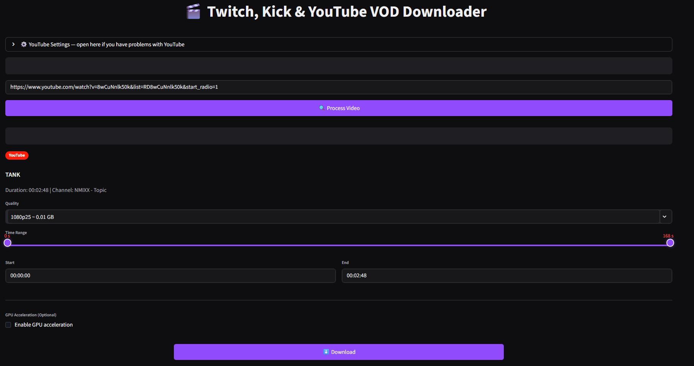

# 🎬 Twitch, Kick & YouTube VOD Downloader

Multi-platform VOD downloader for **Twitch**, **Kick**, and **YouTube**. Provides both a **Streamlit GUI** (`app.py`) and a **CLI tool** (`download_vod.py`) for downloading videos with GPU acceleration, quality selection, and time range trimming.


<p align="center">
  
</p>

---

## ✨ Features

- **🎯 Multi-Platform**: Download from Twitch, Kick and YouTube
- **🎬 Quality Selection**: Choose from available video qualities and framerates
- **⏱️ Time Range Trimming**: Download specific segments
- **🚀 GPU Acceleration**: NVIDIA NVENC, AMD AMF, Intel VAAPI/QuickSync
- **🎨 Modern GUI**: Dark theme Streamlit interface inspired by Twitch
- **🖥️ CLI Tool**: Headless operation via command-line arguments
- **🤖 AI-Ready**: Includes `AGENTS.md` and `SKILL.md` for AI coding agents (opencode, Claude Code, Codex)

---

## 📋 Prerequisites

- Python 3.11 or higher
- [uv](https://docs.astral.sh/uv/) — Python package manager
- [FFmpeg](https://ffmpeg.org/download.html) — Video/audio processing

---

## 🔧 Installation

```bash
# Clone or navigate to the project
cd downloadvods

# Install dependencies
uv sync
```

### Install FFmpeg

- **Windows**: `winget install Gyan.FFmpeg` or download from [gyan.dev](https://www.gyan.dev/ffmpeg/builds/)
- **macOS**: `brew install ffmpeg`
- **Linux**: `sudo apt install ffmpeg`

### Verify

```bash
uv run python -c "import streamlit; print('Streamlit:', streamlit.__version__)"
ffmpeg -version
```

---

## 🎯 Usage

### GUI (Streamlit)

```powershell
uv run streamlit run app.py
```

Opens at `http://localhost:8501`. Paste a URL, select quality, trim range, enable GPU, and download.

### CLI (Command Line)

```powershell
uv run python download_vod.py --url <URL> [options]
```

#### Parameters

| Argument | Required | Default | Description |
|---|---|---|---|
| `--url` | Yes | — | Video URL (Twitch, Kick, YouTube) |
| `--quality` | No | `best` | Quality like `1080p60`, `720p`. Invalid → best |
| `--start` | No | `0` | Start time (seconds or `HH:MM:SS`) |
| `--end` | No | `0` | End time (`0` = full video) |
| `--no-gpu` | No | off | Disable GPU acceleration |
| `--output` / `-o` | No | `.` | Output file (`.mp4`) or directory |
| `--browser` | No | — | Browser for YouTube cookies (`chrome`, `firefox`, etc.) |
| `--quiet` / `-q` | No | off | Suppress progress output |

> **PowerShell note:** URLs containing `&` (e.g. YouTube with `&list=...`) **must** be enclosed in double quotes (`"url"`). PowerShell treats unquoted `&` as a special character.

#### Examples

```powershell
# Basic download (highest quality, full video, auto GPU)
uv run python download_vod.py --url https://www.twitch.tv/videos/123456789

# YouTube with quality, time range, and browser cookies
uv run python download_vod.py --url "https://youtube.com/watch?v=xxxx&list=...&start_radio=1" --quality 1080p --start 00:05:00 --end 00:10:00 --browser chrome

# Kick video with custom output and no GPU
uv run python download_vod.py --url https://kick.com/video/xxx --output D:\videos --no-gpu

# Quiet mode — only the final path goes to stdout
uv run python download_vod.py --url https://youtube.com/watch?v=xxxx --browser chrome --quiet
```

---

## 📁 Project Structure

```
downloadvods/
├── app.py              # Streamlit GUI
├── download_vod.py     # CLI tool (self-contained)
├── AGENTS.md           # AI agent project guide
├── SKILL.md            # AI agent skill definition
├── pyproject.toml      # Dependencies & project metadata
├── requirements.txt    # Pinned dependencies
├── README.md           # This file
├── .python-version     # Python version pin
├── packages.txt        # System packages (ffmpeg)
├── .venv/              # Virtual environment
├── uv.lock             # Lock file
└── README-images/      # Screenshots
```

---

## 🖥️ GPU Acceleration

Auto-detected encoders:

| Vendor | Encoder |
|---|---|
| NVIDIA | `h264_nvenc` |
| AMD | `h264_amf` |
| Intel | `h264_vaapi` / `h264_qsv` |

GPU is enabled by default in the CLI. Use `--no-gpu` to disable.

---

## 🛠️ Technical Details

### Dependencies

- **Streamlit** — Web GUI framework
- **yt-dlp** — Video extraction & downloading
- **FFmpeg** — Encoding, transcoding, trimming
- **Python 3.11+** — Runtime

### Architecture

- **GUI**: `app.py` — Streamlit with custom CSS (Twitch dark theme)
- **CLI**: `download_vod.py` — Standalone argparse tool, no imports from `app.py`
- **Core Pipeline**: yt-dlp download → ffprobe codec detection → ffmpeg transcode/trim → H.264 MP4 output

### Output Format

- **Container**: MP4
- **Video**: H.264 (libx264 CPU / NVENC / AMF / QSV / VAAPI GPU)
- **Audio**: AAC 192 kbps

---

## 🤖 AI Agent Integration

The project includes:

- **`AGENTS.md`** — Project guide for AI coding agents (conventions, setup, CLI reference)
- **`SKILL.md`** — Installable skill definition for opencode / Claude Code / Codex

> The CLI (`download_vod.py`) is self-contained. Changes to it do not affect the GUI (`app.py`) and vice versa.

---

### 📄 License

This project is licensed under the MIT License - see the [LICENSE](LICENSE) file for details.

---

## 👨‍💻 Author / Autor

**Diego Ivan Perea Montealegre**

- GitHub: [@diegoperea20](https://github.com/diegoperea20)

---

Created by [Diego Ivan Perea Montealegre](https://github.com/diegoperea20)
